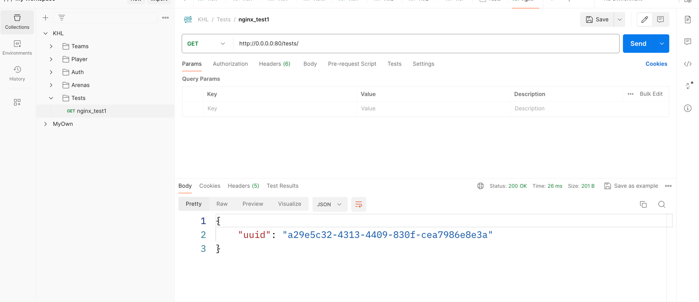

## Usage:

1. Go to . dir and run: `make build`
2. Run: `make up`
3. Look for postman and try test query:

While making multiple queries --> uuid response always will be different because of **round-robbin** algorithm with nginx
4. After testing do not forget to kill all containers: `make down`